## 🔔 Notification System

`g-notifications` is a **standalone** notification system — no framework required.  
You can use it in any FiveM resource, regardless of whether you're using **ESX**, **QBCore**, **QBox**, or no framework at all.

<h3>🖼️ Notification Styles Preview</h3>

  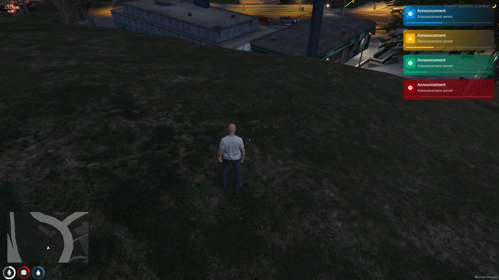
  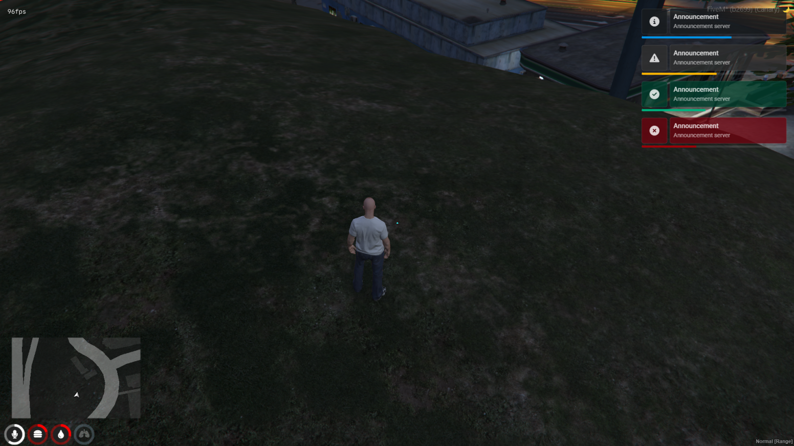
  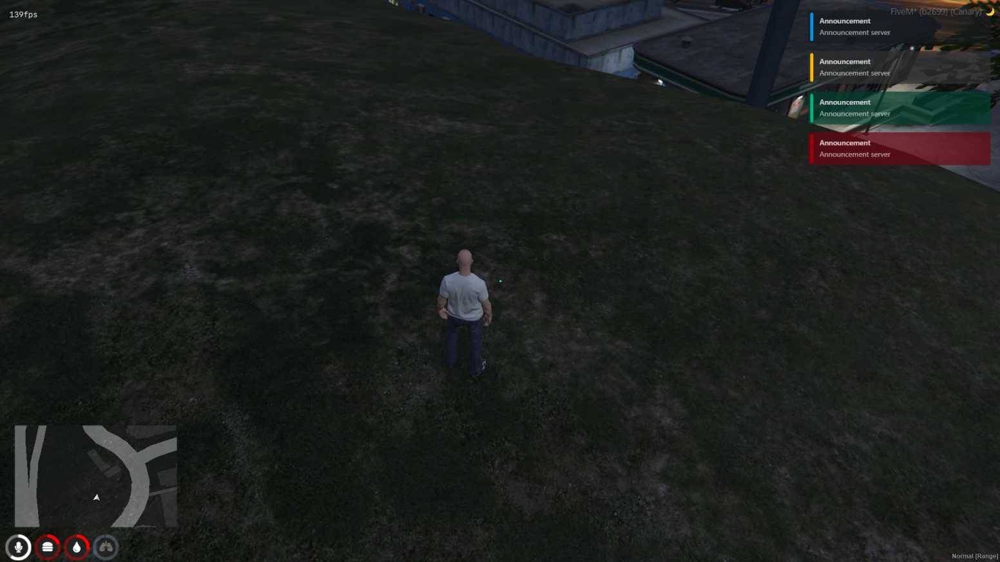
  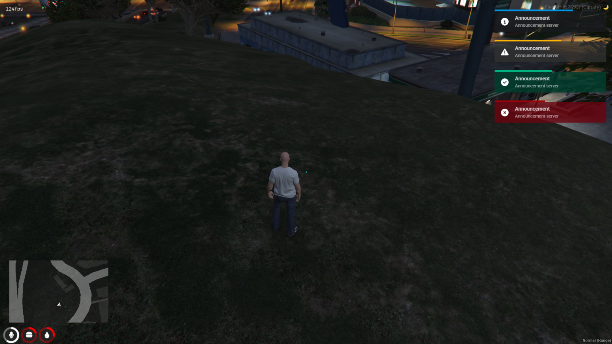
  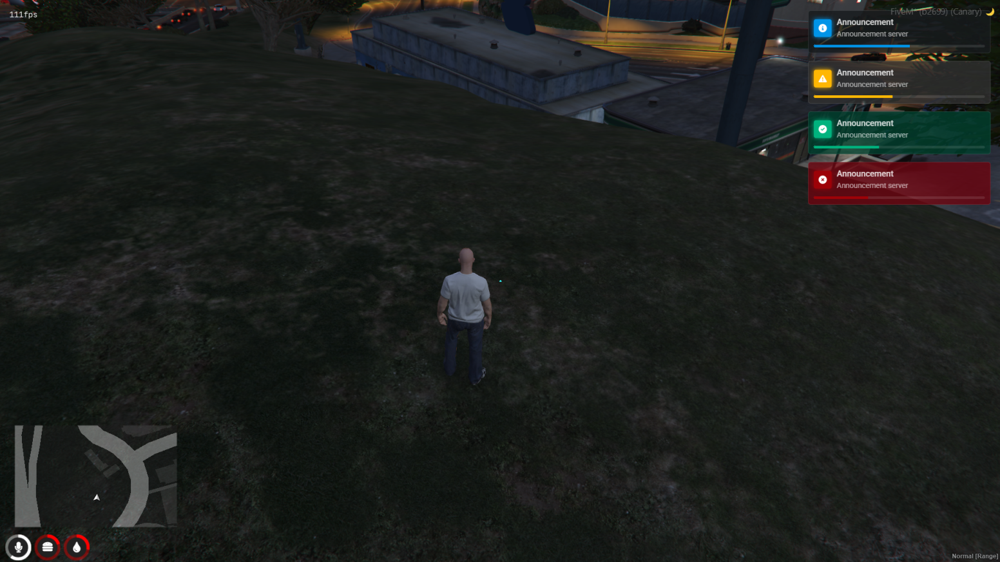
  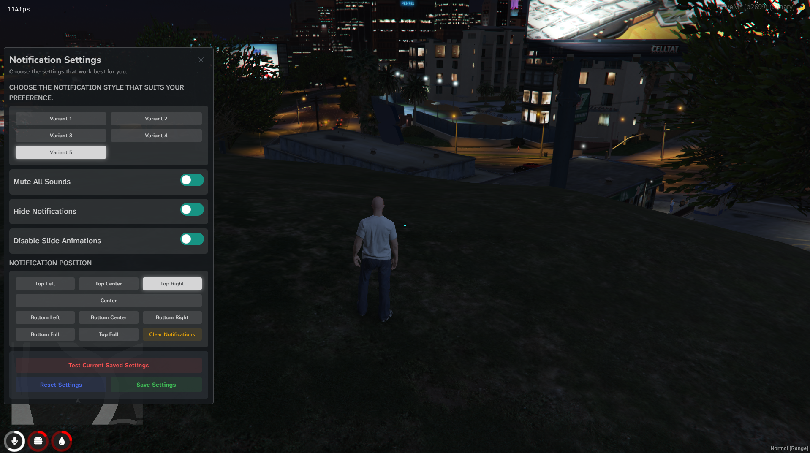

 

* **Showcase Video** - https://youtu.be/wS73A7UDvFo?si=gi6vzLJ760Bt6Oy8
* **Discord** - https://discord.gg/Nm5FSxK2gv
* **Tebex Store** - https://groot-development.tebex.io/
* **Framework Integration Docs** - https://grootdev.gitbook.io/groot-development/free-release/g-notifications

> Note: This version does not include the frontend open. To get the complete UI package, purchase it separately from here - [Tebex](https://groot-development.tebex.io/package/6838310).

<h2 align="center">Other Fivem Scripts</h2>
 

  <table>
    <tr>
      <td align="center" width="50%">
        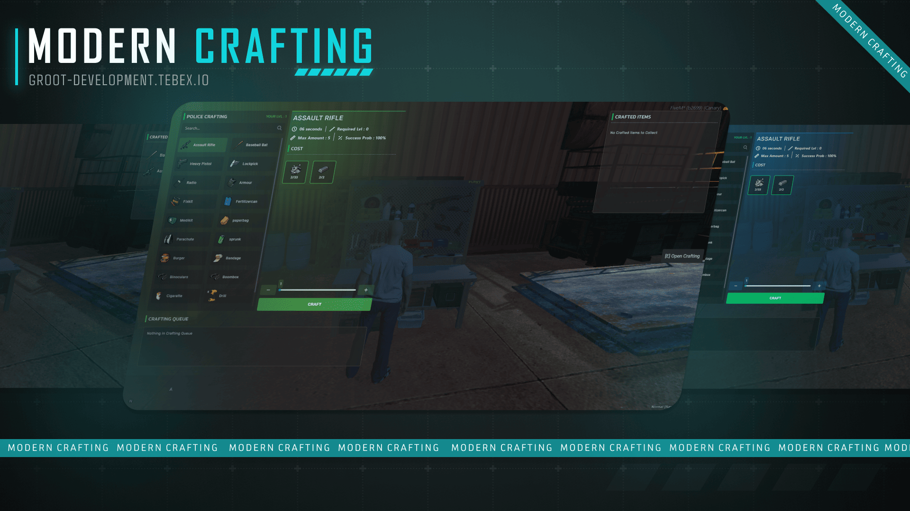
        

          
          
        

      </td>
      <td align="center" width="50%">
        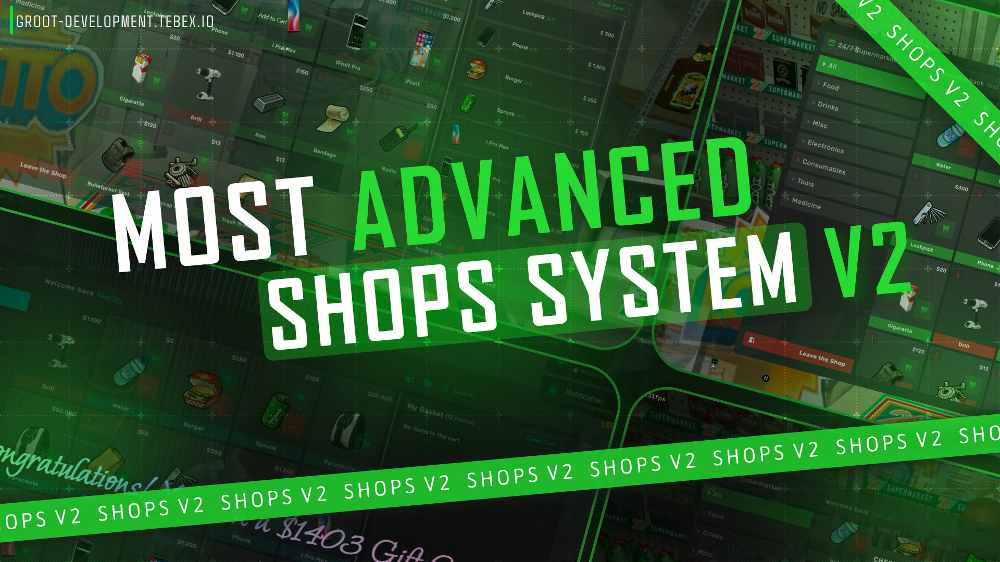
        

          
          
        

      </td>
    </tr>
    <tr>
      <td align="center">
        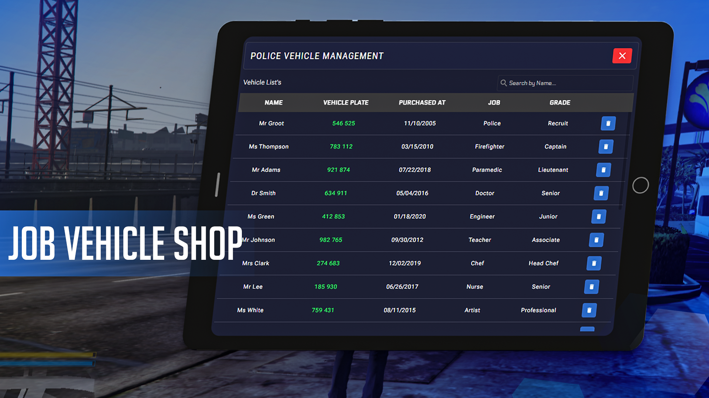
        

          
          
        

      </td>
      <td align="center">
        
        

          
          
        

      </td>
    </tr>
    <tr>
      <td align="center">
        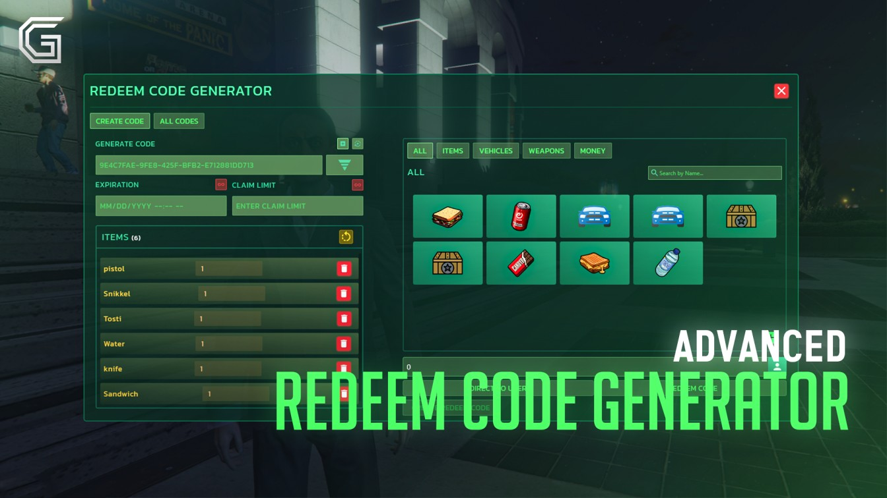
        

          
          
        

      </td>
      <td align="center">
        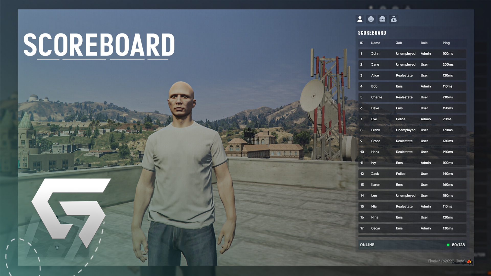
        

          
          
        

      </td>
    </tr>
    <tr>
      <td align="center">
        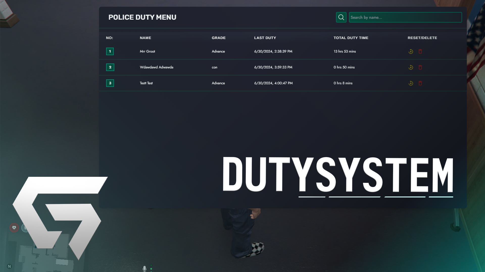
        

          
          
        

      </td>
      <td></td>
    </tr>
  </table>

<h2 align="center">Other Fivem Maps</h2>

  <table>
    <tr>
      <td>
        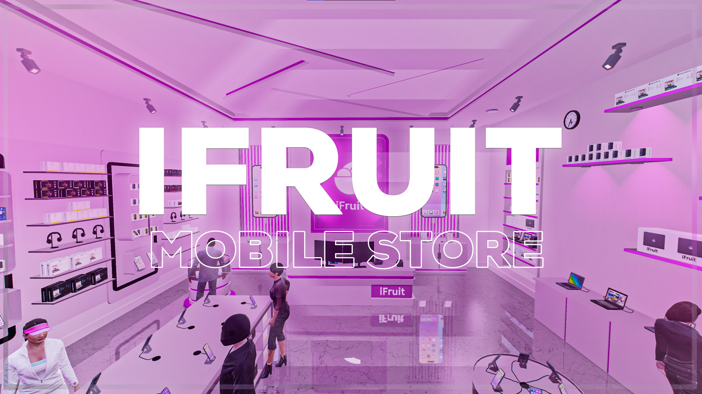
        

          
          
        

      </td>
      <td>
        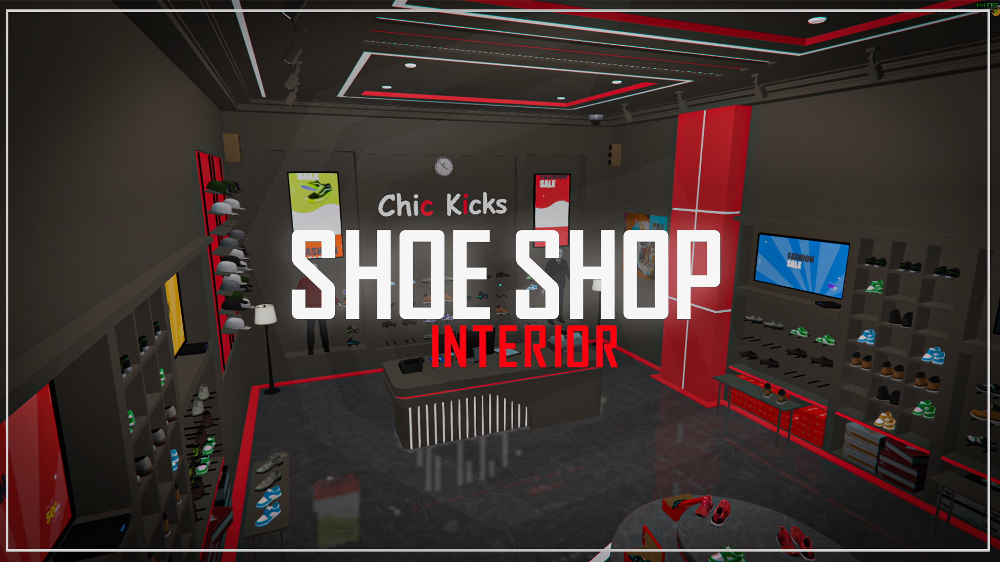
        

          
          
        

      </td>
    </tr>
  </table>

